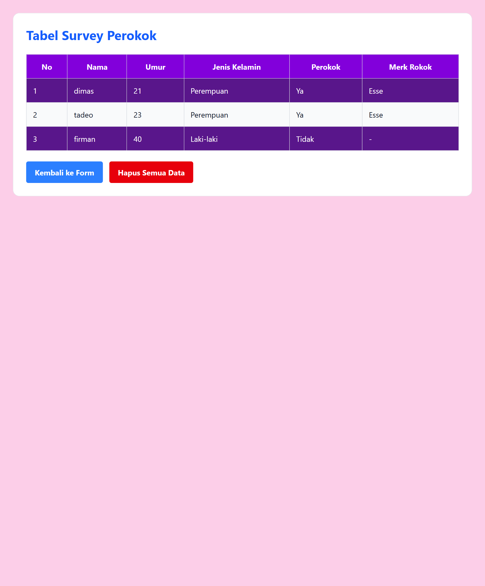

# Membuat halaman dengan react, Form Handling dengan react hook & yup

## berikut merupakan review survey perokok dan table response 

ini merupakan form survey perokok dengan table response, dimana data yang diinput akan disimpan ke local storage. untuk form handling menggunakan react hook from & yup library, dan untuk JS DOM sudah dibuatkan dokumentasi dengan js docs

## Screenshot

<table>
  <tr>
    <td>
      
    </td>
    <td>
      
    </td>
  </tr>
  <tr>
    <td>
      Form Survey
    </td>
    <td>
      Table Response
    </td>
  </tr>
  
</table>

## Demo Aplikasi

